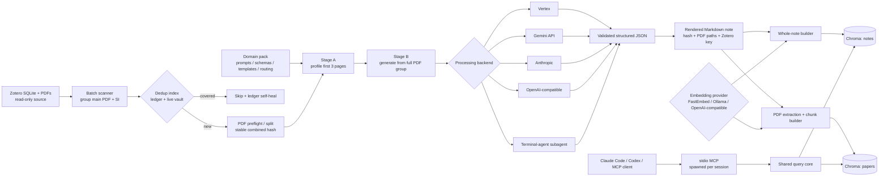
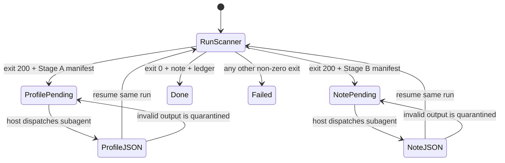

# research-rag

**English** | [简体中文](README_zh-CN.md)

<!-- Keep this file in sync with README_zh-CN.md. -->

**Turn your Zotero library into durable research memory for AI agents.**

[](https://github.com/ltczding-gif/research-rag/actions/workflows/test.yml)

[](LICENSE)


`research-rag` is an open, local-first pipeline that transforms Zotero papers and
supporting information into structured Markdown notes, indexes both the notes and
their source passages, and gives Claude Code, Codex, or any MCP client a reusable
evidence layer.

**Keep the knowledge. Trace it to the source. Bring your own models.**

[Run the local demo](#2-prove-the-local-retrieval-stack-works) ·
[Process your first paper](#3-process-your-first-zotero-paper) ·
[Explore the architecture](#architecture-at-a-glance) ·
[Build a domain pack](#domain-packs)

> **Status: alpha.** The core pipeline and recovery paths are tested, but public
> interfaces may still change. Generated notes are research aids, not verified
> scientific ground truth. Notes and indexes stay in directories you choose;
> document transmission depends on the note-generation backend you configure.

## Your research memory should outlive a chat

One-off PDF conversations are useful, but a literature review grows across dozens
or hundreds of papers. The hard part is not asking one question. It is preserving
what was learned, keeping supporting information attached to the right article,
finding the original evidence again, and making the result reusable by the next
agent session.

`research-rag` creates that persistent layer between your source library and your
AI tools:

```text
Zotero library -> paper + SI groups -> structured Markdown -> two local indexes -> MCP agents
```

Zotero remains the read-only source library. Markdown becomes the inspectable,
portable knowledge asset. ChromaDB indexes are disposable acceleration layers that
can be rebuilt from the notes and source PDFs.

## Why research-rag

| Benefit | What the repository delivers |
|---|---|
| **Research memory, not chat history** | Structured Markdown notes survive model changes, client changes, and individual agent sessions. |
| **Evidence you can inspect** | Whole-note search finds the right paper; source-passage search returns to the original PDF text. |
| **Your literature structure stays intact** | Zotero parent items keep the main article and supporting information in one processing unit. |
| **A stack you can change piece by piece** | Choose among five generation backends and three embedding providers independently. |
| **Domain depth without a fork** | Domain packs bundle prompts, schemas, templates, quality rules, and model routing. |
| **Automation that can resume** | Content hashes, ledgers, pending manifests, migration checks, and index health checks make long-running libraries recoverable. |

The default route is deliberately lightweight: a terminal-agent subagent generates
notes and in-process FastEmbed powers retrieval, so you do not need a separate LLM
API credential, embedding daemon, or always-running web application to get started.

## Built for a library, not a one-off upload

This project occupies a different layer from a typical single-document chat flow:

| | Common one-off PDF chat flow | `research-rag` |
|---|---|---|
| Starting point | Manually selected documents | A Zotero PDF library |
| Durable output | A conversation or exported answer | Structured, reviewable Markdown notes |
| Main paper + SI | Usually handled as separate files | Grouped by Zotero parent item |
| Retrieval | Conversation context or document chunks | Whole-note discovery plus source-PDF passage search |
| Reuse by agents | Tied to a product session | Four stdio MCP tools usable from compatible clients |
| Specialization | General-purpose instructions | Versioned domain packs with schemas and quality rules |
| Recovery | Repeat the session or upload | Resume manifests, content hashes, ledgers, and rebuildable indexes |

It is a strong fit for:

- researchers who want a growing Zotero collection to become queryable knowledge;
- labs and review projects that need inspectable artifacts instead of opaque chat history;
- agent builders who need a scientific evidence layer exposed through MCP;
- domain communities that want to publish reusable extraction and review conventions.

It is not a Zotero replacement, a hosted SaaS, or an automatic truth engine. It is
a transparent pipeline for turning a literature library into durable, retrievable
research context.

## What ships today

- Zotero-aware discovery for stored, linked, and absolute-path PDF attachments.
- Two-stage generation: document profiling first, full-group structured extraction second.
- Five generation backends: terminal subagent, Vertex AI, Gemini API, Anthropic, and OpenAI-compatible.
- Three embedding providers: in-process FastEmbed, Ollama, and OpenAI-compatible.
- Four stdio MCP tools: `search_notes`, `search_papers`, `get_note`, and `index_status`.
- Cross-platform guided setup, a synthetic demo that needs no Zotero library or LLM API key, health checks, and recovery commands.
- A ready-to-use catalysis domain pack plus a template for creating new fields.

## Ask questions that build on your library

Once connected, an MCP-capable agent can combine fast note discovery with targeted
source retrieval. For example:

```text
Find the papers in my library that disagree about [topic].
Start with the structured notes, then retrieve the strongest source-PDF passages
for each position. Keep note-level synthesis separate from source evidence.
```

The same primitives support literature mapping, single-paper review, method lookup,
cross-paper comparison, contradiction hunting, and returning from a remembered
claim to the passage that originally supported it.

## Quick start

### 1. Install and configure

Requirements: Git and Python 3.10 or newer. Python 3.11 is the validated reference.

macOS / Linux:

```bash
git clone https://github.com/ltczding-gif/research-rag.git
cd research-rag
./setup.sh
```

Windows PowerShell:

```powershell
git clone https://github.com/ltczding-gif/research-rag.git
Set-Location research-rag
.\setup.ps1
```

The setup command creates one `.venv`, installs the default runtime, and immediately
opens the configuration walkthrough. The walkthrough configures:

1. notes and state directories;
2. the note-generation backend (`subagent` by default);
3. Zotero paths;
4. the embedding provider (`fastembed` by default);
5. a domain pack;
6. terminal-agent skills and machine-specific MCP registration;
7. a final health check.

An empty index is reported as a warning, not hidden as “all green”. To install only
dependencies and run the walkthrough later, use `./setup.sh --no-init` or
`.\setup.ps1 -SkipInit`.

### 2. Prove the local retrieval stack works

This isolated demo needs no Zotero library and no LLM API key. It creates three
temporary notes, builds an index, starts the MCP launcher, runs searches, and removes
the temporary data when finished. The first run downloads the default multilingual
embedding model.

macOS / Linux:

```bash
.venv/bin/python scripts/demo.py
```

Windows PowerShell:

```powershell
.\.venv\Scripts\python.exe scripts\demo.py
```

Success ends with the MCP round-trip checks marked `PASS`.

### 3. Process your first Zotero paper

Close Zotero before scanning. The easiest default route is to open Claude Code or
Codex in the repository and ask the agent:

```text
Use the gemini-literature-processor workflow to process one Zotero paper.
Use the subagent backend, publish the note, build both indexes, then verify index_status.
```

The agent workflow handles the subagent resume protocol described below. If you chose
a direct API backend during setup, the equivalent CLI can complete in one process:

macOS / Linux:

```bash
.venv/bin/python scanner/zotero_batch_scanner.py \
  --limit 1 \
  --post-publish none
.venv/bin/python scripts/build_indexes.py
```

Windows PowerShell:

```powershell
& .\.venv\Scripts\python.exe scanner\zotero_batch_scanner.py `
  --limit 1 `
  --post-publish none
if ($LASTEXITCODE -ne 0) { throw "scanner failed" }

& .\.venv\Scripts\python.exe scripts\build_indexes.py
if ($LASTEXITCODE -ne 0) { throw "index build failed" }
```

Ask the MCP client to call `index_status`. A complete first result has
`notes_ready: true`, `papers_ready: true`, at least one note, and at least one paper
chunk. Then try:

```text
/search-literature What are the main claims and the strongest supporting evidence?
```

### Already have Markdown notes?

Point `LOCALRAG_NOTES_DIR` at the directory during setup, then run
`scripts/build_indexes.py`. Whole-note search needs `*_review_note.md` files with a
`zotero_parent_key` in YAML frontmatter. PDF passage search additionally discovers
`pdf_0_path`, `pdf_1_path`, and later fields from that frontmatter.

## Architecture at a glance

The system has three planes: note generation, local indexing, and terminal-agent
retrieval. Note-generation backends and embedding providers are independent choices.



### Component responsibilities

| Area | Responsibility | Main entry points |
|---|---|---|
| `scanner/` | Zotero discovery, PDF preflight, two-stage generation, rendering, publish, resume | `zotero_batch_scanner.py`, `gemini_analyze_pdf.py` |
| `scanner/backends/` | PDF/model transport and structured-output adaptation | `subagent.py`, `vertex.py`, `gemini_api.py`, `anthropic_api.py`, `openai_api.py` |
| `domain-packs/` | Field-specific prompts, schemas, templates, quality rules, routing | `catalysis/`, `_template/` |
| `service/` | Note/PDF ingestion, embeddings, query core, HTTP compatibility layer, MCP | `build_notes_db.py`, `build_pdf_db.py`, `query_server.py`, `mcp_server.py` |
| `scripts/` | Cross-platform entry points and verification | `run_mcp_server.py`, `build_indexes.py`, `demo.py` |
| `skills/` | Agent-facing workflows layered over the four MCP tools | `search-literature`, `gemini-literature-processor`, leaf skills |

## Detailed generation flow

1. The scanner copies `zotero.sqlite` to a temporary snapshot and reads PDF
   attachments without modifying the Zotero database.
2. Attachments are resolved from Zotero `storage:`, linked-file, or absolute paths
   and grouped by parent item. Main text and SI remain one logical paper.
3. Each file is SHA-256 hashed. The sorted per-file hashes form an order-independent
   `combined_hash` for deduplication and resume identity.
4. The dedup gate checks both the generation ledger and current note frontmatter.
   A vault hit can repair a missing ledger entry without regenerating the note.
5. PDF preflight rejects missing/corrupt inputs and slices files that exceed a
   backend's page or byte limits.
6. Stage A reads the primary PDF's first three pages using the active domain pack's
   profiler prompt and schema. It selects a document type, note template, and model tier.
7. Stage B reads the full PDF group, combines the selected template with global and
   domain quality rules, and produces a structured draft.
8. The draft is schema-validated and rendered into a deterministic Markdown contract.
   Frontmatter includes bibliographic fields, `combined_hash`, `zotero_parent_key`,
   and every `pdf_N_path`.
9. The note is published atomically. Only then is the generation ledger updated.
10. Optional post-publish scripts run when present; a fresh vault without those
    scripts skips them instead of turning a successful batch into a failure.

For batches of five or fewer papers, processing is sequential. Larger batches use at
most three workers.

### Default subagent state machine

The `subagent` backend does not call an LLM SDK from Python. It writes a manifest for
the host terminal agent and exits with code `200` to mean “work is pending”.



Run directories are keyed by the paper hash so output from one paper cannot be resumed
into another. Empty, partial, or schema-invalid JSON is quarantined and redispatched.
The exact host contract is in
[`skills/gemini-literature-processor/references/subagent-host-contract.md`](skills/gemini-literature-processor/references/subagent-host-contract.md).

## Indexing and retrieval flow

Indexing is explicit. Publishing a note does not silently rebuild the vector stores.
Use `scripts/build_indexes.py` after a generation batch.

| Collection | Discovery | Unit of embedding | Stable link |
|---|---|---|---|
| `notes` | top-level `*_review_note.md` files | one whole Markdown note | `zotero_parent_key` |
| `papers` | `pdf_N_path` fields in note frontmatter | 800-character chunks, 700-character step | `zotero_parent_key` + content hashes |

The paper builder removes text after the final References, Bibliography, or
Acknowledgements heading when detected. Chunk IDs contain group and file content
hashes, so adding another note or reordering PDFs does not change existing IDs.
When paper content changes, stale chunks for the same `pdf_path` are removed before
the replacement is inserted.

At query time the terminal agent spawns `scripts/run_mcp_server.py`. The launcher
switches into the repository's service-capable venv, then starts the stdio MCP server.
No Flask process is needed for the normal path; `service/query_server.py` remains an
optional HTTP compatibility layer over the same query functions.

| MCP tool | Use |
|---|---|
| `search_notes` | Broad semantic discovery over full structured notes |
| `search_papers` | Evidence lookup in original PDF chunks; can filter by Zotero parent key |
| `get_note` | Fetch a complete indexed note by filename or Zotero parent key |
| `index_status` | Check readiness, counts, embedding provider/model, and dimension problems |

The typical retrieval strategy is broad-to-narrow: discover relevant notes, extract
their `zotero_parent_key`, search the corresponding source PDFs, then fetch the full
note only when needed.

## State and identity contracts

| State | Default location | Purpose |
|---|---|---|
| Generated notes | `LOCALRAG_NOTES_DIR` | durable, human-readable source of truth |
| Subagent run artifacts | under the configured notes/progress area | resumable Stage A/B manifests and JSON |
| Generation ledger | `scanner/processed_history.txt` unless overridden | prevents duplicate note generation |
| ChromaDB | `LOCALRAG_HOME/chroma` | derived `notes` and `papers` collections |
| Notes ingest ledger | `LOCALRAG_HOME/processed_notes.txt` | incremental whole-note indexing |
| Papers ingest ledger | `LOCALRAG_HOME/processed_groups.txt` | incremental PDF-group indexing |
| Query logs | `LOCALRAG_QUERY_LOG_ROOT` | workflow outcomes and diagnostics |

`combined_hash` identifies a PDF group for generation and resume.
`zotero_parent_key` joins the human-readable note to all source-PDF chunks.
Ingest ledgers are optimization state, not the primary research record.

## Choose the two independent backends

### Note-generation backend

| Backend | Credential / transport | Best fit |
|---|---|---|
| `subagent` (default) | no separate API key; host terminal agent reads PDFs | easiest Claude Code/Codex start |
| `gemini-api` | Google AI Studio key; inline PDF | simple direct Gemini batches |
| `anthropic` | Anthropic key; base64 PDF content blocks | direct Claude PDF processing |
| `openai` | OpenAI or compatible key; local text extraction | compatible endpoints; figures are not transmitted |
| `vertex` | GCP project, service account, GCS bucket | managed GCP / native PDF workflow |

The setup walkthrough offers to install only the SDK for the selected cloud backend.
Manual manifests live under `requirements-backends/`.

### Embedding provider

| Provider | Requirements | Notes |
|---|---|---|
| `fastembed` (default) | first-use model download | in-process, multilingual, no daemon/key |
| `ollama` | running Ollama + pulled model | local quality/size trade-offs |
| `openai-compat` | embedding endpoint and key when required | cloud or self-hosted `/v1/embeddings` |

The generation backend never determines the embedding provider. For example,
Anthropic can generate notes while local Ollama embeds them.

## Data and trust boundaries

| Data | Local by default? | Can leave the machine when |
|---|---:|---|
| Zotero SQLite and original PDFs | yes | the selected generation backend or host subagent sends content to its model provider |
| Generated Markdown notes | yes | you sync the notes directory or include note text in a model request |
| ChromaDB vectors and ingest ledgers | yes | you explicitly move or back up `LOCALRAG_HOME` remotely |
| Query text and results | yes | your terminal-agent provider receives the conversation |
| Vertex staging PDFs | no | `vertex` uploads them to the configured GCS bucket |

The scanner reads a temporary SQLite copy and does not write to Zotero. API keys and
service-account files belong in `.env` or outside the repository; `.env` is ignored by Git.

## Daily operations

macOS / Linux examples:

```bash
# Incremental recent scan
.venv/bin/python scanner/zotero_batch_scanner.py --since 2026-07-01 --limit 20

# Inspect pending subagent work
.venv/bin/python scanner/list_pending_subagent_runs.py --json

# Refresh both indexes after notes change
.venv/bin/python scripts/build_indexes.py

# Re-run health checks
.venv/bin/python scanner/doctor.py
```

PowerShell uses the same arguments with `.\.venv\Scripts\python.exe`.

## Failure and recovery

| Symptom | Meaning / next action |
|---|---|
| scanner exit `200` | expected for subagent; dispatch the pending manifest and resume |
| scanner exit `1` or another non-zero code | real failure; inspect stderr and the run directory before retrying |
| `local indexes: not built yet` | generate/import notes, then run `scripts/build_indexes.py` |
| MCP tools missing | rerun setup in the intended venv, then run `scanner/doctor.py` |
| embedding dimension mismatch | first restore the provider/model that built the index; rebuild only after deciding to migrate |
| legacy papers ID schema | run `scripts/build_indexes.py --rebuild-papers` |
| suspected ledger drift | preview with `scanner/verify_and_clean.py`; use `--clean` only after review |
| old notes missing stable hashes | preview `scanner/backfill_hash.py`; use `--write` only after review |

Changing the embedding provider or model requires rebuilding the affected collections
and their ingest ledgers together. Back up `LOCALRAG_HOME` first. Never delete Zotero
PDFs or generated Markdown notes as if they were cache.

## Advanced installation

The default single venv is the recommended path. For machines with conflicting Python
stacks, isolated mode creates `scanner/.venv` and `service/.venv`:

```bash
./setup.sh --isolated
```

```powershell
.\setup.ps1 -Isolated
```

The walkthrough records the exact installed interpreter paths in `.env`, so optional
post-publish actions and MCP clients do not depend on a cross-platform `python` alias.
The repository's `.mcp.json` is a shared fallback; local Claude Code/Codex registration
created by the walkthrough takes precedence and pins the actual venv interpreter.

### Claude Code plugin (optional)

The plugin installs the agent workflow layer; it does not install Python, ChromaDB, or
the runtime dependencies.

```text
/plugin marketplace add ltczding-gif/research-rag
/plugin install research-rag@research-rag
```

You can also copy `skills/*` into your agent's skill directory during the walkthrough.

## Domain packs

Python orchestration is intentionally domain-agnostic. A domain pack supplies:

- Stage A and Stage B prompts;
- JSON schemas;
- document-type note templates;
- domain quality rules and terminology hints;
- flash/pro model routing policy.

The repository includes `catalysis` and a reusable `_template`. See
[`docs/Domain_Pack_Authoring_Guide.md`](docs/Domain_Pack_Authoring_Guide.md).

## Development and verification

```bash
python -m pytest tests -q
python -m pytest tests/test_entrypoint_smoke.py tests/test_mcp_server.py -q
```

CI covers Windows, macOS, and Linux on supported Python versions. The synthetic demo
is the user-facing end-to-end retrieval check; real cloud calls remain opt-in.

Current contracts and guides:

- [`docs/Domain_Pack_Authoring_Guide.md`](docs/Domain_Pack_Authoring_Guide.md)
- [`skills/gemini-literature-processor/references/subagent-host-contract.md`](skills/gemini-literature-processor/references/subagent-host-contract.md)
- [`scanner/references/workflow-runbook.md`](scanner/references/workflow-runbook.md)
- [`tests/README.md`](tests/README.md)

Files under `docs/audits/`, `docs/investigation/`, and `docs/plans/`, plus older
architecture/status snapshots, are historical evidence. They are not the current
installation contract; this README and the live code take precedence.

## Known limitations

- There is no redistributable real-paper corpus; `scripts/demo.py` uses synthetic notes.
- The notes builder scans only top-level files matching the configured suffix.
- The OpenAI-compatible generation backend sends extracted text, so figures and layout are lost.
- The default subagent path depends on a capable terminal-agent host and may consume that provider's quota.
- First-use FastEmbed model download requires internet access.
- Generated scientific claims still need human verification against the source PDFs.

## License

[MIT](LICENSE)
