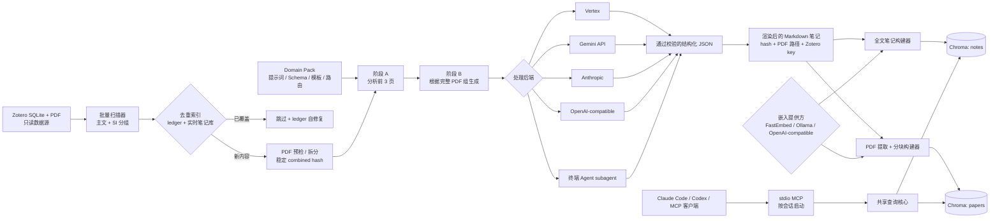
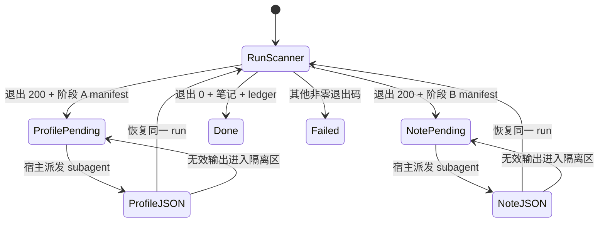

# research-rag

[English](README.md) | **简体中文**

<!-- 与 README.md 同步维护。 -->

**把你的 Zotero 文献库，变成 AI Agent 可长期使用的研究记忆。**

[](https://github.com/ltczding-gif/research-rag/actions/workflows/test.yml)

[](LICENSE)


`research-rag` 是一套开放、local-first 的文献处理流水线：它把 Zotero 中的论文与
Supporting Information（SI）转换为结构化 Markdown 笔记，同时为笔记和原文段落建立
本地索引，再通过 MCP 为 Claude Code、Codex 或其他兼容客户端提供可复用的证据层。

**保留知识。追溯原文。自由选择模型。**

[运行本地演示](#2-验证本地检索链路) ·
[处理第一篇论文](#3-处理第一篇-zotero-论文) ·
[查看架构](#架构总览) ·
[创建 Domain Pack](#domain-pack)

> **状态：alpha。** 核心流水线和恢复路径已经过测试，但公开接口仍可能发生变化。
> 生成的笔记是研究辅助材料，不是经过验证的科学事实。笔记和索引保存在你指定的目录；
> 文档是否会发送到外部服务，取决于你选择的笔记生成后端。

## 研究记忆不该随着一次对话消失

单次 PDF 对话很有用，但真正的文献综述往往横跨几十甚至几百篇论文。难点不只是问出
一个问题，而是保存已经获得的认识、让 SI 始终归属于正确的主文、再次定位原始证据，
并让下一次 Agent 会话继续使用这些成果。

`research-rag` 在原始文献库与 AI 工具之间建立了一层可持久保存的研究记忆：

```text
Zotero 文献库 -> 主文 + SI 分组 -> 结构化 Markdown -> 两个本地索引 -> MCP Agent
```

Zotero 仍然是只读的源文献库；Markdown 成为可检查、可迁移的知识资产；ChromaDB
只是可随时根据笔记和源 PDF 重建的检索加速层。

## 为什么选择 research-rag

| 收益 | 仓库提供的能力 |
|---|---|
| **积累研究记忆，而不是聊天记录** | 结构化 Markdown 笔记不会随着模型、客户端或单次 Agent 会话的变化而消失。 |
| **每条证据都可以检查** | 全文笔记检索负责找到正确论文，原文段落检索负责返回源 PDF 文本。 |
| **保留真实的文献组织结构** | 根据 Zotero parent item，把主文和 SI 作为同一个处理单元。 |
| **每一层都能独立替换** | 五种生成后端与三种嵌入提供方可以自由组合。 |
| **不用 fork 也能适配新领域** | Domain Pack 集中管理提示词、Schema、模板、质量规则与模型路由。 |
| **长批次可恢复、可迁移** | 内容哈希、ledger、pending manifest、迁移检查和索引健康检查共同保障恢复能力。 |

默认路径刻意保持轻量：终端 Agent 的 subagent 负责生成笔记，进程内 FastEmbed 负责
检索，因此首次上手不需要单独的 LLM API key、嵌入服务进程或常驻 Web 应用。

## 面向整座文献库，而不是一次性上传

这个项目所处的层次与常见的单文档对话流程不同：

| | 常见的一次性 PDF 对话 | `research-rag` |
|---|---|---|
| 起点 | 手动选择文档 | Zotero PDF 文献库 |
| 可持久结果 | 对话或导出的回答 | 结构化、可审查的 Markdown 笔记 |
| 主文与 SI | 通常作为独立文件处理 | 按 Zotero parent item 自动分组 |
| 检索方式 | 对话上下文或文档分块 | 全文笔记发现 + 源 PDF 段落检索 |
| Agent 复用 | 依赖特定产品会话 | 四个 stdio MCP 工具，可供兼容客户端调用 |
| 领域适配 | 通用指令 | 带 Schema 和质量规则的版本化 Domain Pack |
| 故障恢复 | 重新对话或重新上传 | Resume manifest、内容哈希、ledger 与可重建索引 |

特别适合：

- 希望把不断增长的 Zotero 收藏转化为可查询知识的研究者；
- 需要可审查研究产物，而不是黑盒聊天记录的实验室和综述项目；
- 希望通过 MCP 为 Agent 增加科学证据层的开发者；
- 希望发布可复用抽取规范与评审标准的领域社区。

它不是 Zotero 的替代品，不是托管 SaaS，也不是自动真理机器。它是一套透明的流水线，
负责把文献库转化为可长期保存、可检索、可回到原文核验的研究上下文。

## 当前已经交付

- 识别 Zotero storage、linked-file 与绝对路径 PDF，并按父条目组织文献。
- 两阶段生成：先判断文档结构，再对完整 PDF 组执行结构化抽取。
- 五种生成后端：终端 subagent、Vertex AI、Gemini API、Anthropic 和 OpenAI-compatible。
- 三种嵌入提供方：进程内 FastEmbed、Ollama 和 OpenAI-compatible。
- 四个 stdio MCP 工具：`search_notes`、`search_papers`、`get_note` 和 `index_status`。
- 跨平台引导式安装、无需 Zotero 和 LLM API key 的合成演示、健康检查与恢复命令。
- 一个可直接使用的催化领域 Domain Pack，以及创建新领域包的模板。

## 让问题建立在整座文献库之上

连接完成后，支持 MCP 的 Agent 可以先快速发现相关笔记，再定向返回源 PDF 查找证据。
例如：

```text
找出我的文献库中对 [主题] 持不同观点的论文。
先检索结构化笔记，再为每种观点查找最有力的源 PDF 段落。
请明确区分笔记层面的综合结论与原文证据。
```

同一套能力还可以支持研究版图梳理、单篇精读、实验方法定位、跨论文对比、矛盾发现，
以及从一个记住的结论返回最初支持它的原文段落。

## 快速开始

### 1. 安装并配置

要求：Git 和 Python 3.10 或更高版本。Python 3.11 是经过验证的参考版本。

macOS / Linux：

```bash
git clone https://github.com/ltczding-gif/research-rag.git
cd research-rag
./setup.sh
```

Windows PowerShell：

```powershell
git clone https://github.com/ltczding-gif/research-rag.git
Set-Location research-rag
.\setup.ps1
```

安装命令会创建一个 `.venv`、安装默认运行时，并立即打开配置向导。向导将配置：

1. 笔记目录和状态目录；
2. 笔记生成后端（默认 `subagent`）；
3. Zotero 路径；
4. 嵌入提供方（默认 `fastembed`）；
5. Domain Pack；
6. 终端 Agent skills 和与本机相关的 MCP 注册；
7. 最终健康检查。

空索引会被明确报告为 warning，而不会伪装成“一切正常”。如果只想安装依赖、稍后再运行
向导，请使用 `./setup.sh --no-init` 或 `.\setup.ps1 -SkipInit`。

### 2. 验证本地检索链路

这个隔离演示不需要 Zotero 文献库，也不需要 LLM API key。它会创建三篇临时笔记、
构建索引、启动 MCP launcher、执行检索，并在结束后删除临时数据。首次运行会下载默认的
多语言嵌入模型。

macOS / Linux：

```bash
.venv/bin/python scripts/demo.py
```

Windows PowerShell：

```powershell
.\.venv\Scripts\python.exe scripts\demo.py
```

成功时，最后一组 MCP 往返检查会全部标记为 `PASS`。

### 3. 处理第一篇 Zotero 论文

扫描前请关闭 Zotero。最简单的默认路径是在仓库目录中打开 Claude Code 或 Codex，
然后告诉 Agent：

```text
使用 gemini-literature-processor 工作流处理一篇 Zotero 论文。
使用 subagent 后端，发布笔记，构建两个索引，然后验证 index_status。
```

Agent 工作流会处理下文介绍的 subagent resume 协议。如果你在安装时选择了直接 API
后端，也可以在单一进程中使用等价 CLI：

macOS / Linux：

```bash
.venv/bin/python scanner/zotero_batch_scanner.py \
  --limit 1 \
  --post-publish none
.venv/bin/python scripts/build_indexes.py
```

Windows PowerShell：

```powershell
& .\.venv\Scripts\python.exe scanner\zotero_batch_scanner.py `
  --limit 1 `
  --post-publish none
if ($LASTEXITCODE -ne 0) { throw "scanner failed" }

& .\.venv\Scripts\python.exe scripts\build_indexes.py
if ($LASTEXITCODE -ne 0) { throw "index build failed" }
```

让 MCP 客户端调用 `index_status`。完整的首次结果应包含 `notes_ready: true`、
`papers_ready: true`、至少一篇笔记和至少一个论文分块。然后尝试：

```text
/search-literature 这些论文的主要结论是什么？最有力的原文证据在哪里？
```

### 已经有 Markdown 笔记？

在安装时把 `LOCALRAG_NOTES_DIR` 指向现有目录，然后运行 `scripts/build_indexes.py`。
全文笔记检索要求文件名匹配 `*_review_note.md`，并在 YAML frontmatter 中包含
`zotero_parent_key`。PDF 段落检索还会从 frontmatter 中发现 `pdf_0_path`、
`pdf_1_path` 及后续字段。

## 架构总览

系统分为三个平面：笔记生成、本地索引和终端 Agent 检索。笔记生成后端与嵌入提供方
是两个彼此独立的选择。



### 组件职责

| 区域 | 职责 | 主要入口 |
|---|---|---|
| `scanner/` | Zotero 发现、PDF 预检、两阶段生成、渲染、发布与恢复 | `zotero_batch_scanner.py`、`gemini_analyze_pdf.py` |
| `scanner/backends/` | PDF/模型传输与结构化输出适配 | `subagent.py`、`vertex.py`、`gemini_api.py`、`anthropic_api.py`、`openai_api.py` |
| `domain-packs/` | 领域提示词、Schema、模板、质量规则与路由 | `catalysis/`、`_template/` |
| `service/` | 笔记/PDF 入库、嵌入、查询核心、HTTP 兼容层与 MCP | `build_notes_db.py`、`build_pdf_db.py`、`query_server.py`、`mcp_server.py` |
| `scripts/` | 跨平台入口与验证 | `run_mcp_server.py`、`build_indexes.py`、`demo.py` |
| `skills/` | 构建在四个 MCP 工具之上的 Agent 工作流 | `search-literature`、`gemini-literature-processor` 及叶级 skills |

## 详细生成流程

1. 扫描器把 `zotero.sqlite` 复制为临时快照，在不修改 Zotero 数据库的情况下读取 PDF
   附件。
2. 系统解析 Zotero `storage:`、linked-file 或绝对路径附件，并按 parent item 分组；
   主文与 SI 始终作为同一篇逻辑论文。
3. 每个文件分别计算 SHA-256；排序后的逐文件哈希形成与顺序无关的 `combined_hash`，
   用于去重和恢复身份。
4. 去重门同时检查生成 ledger 与当前笔记 frontmatter。即使 ledger 条目丢失，只要笔记库
   已有对应内容，就能补回 ledger 而不重新生成笔记。
5. PDF 预检会拒绝缺失或损坏的输入，并在文件超过后端页数或字节限制时自动拆分。
6. 阶段 A 使用当前 Domain Pack 的 profiler prompt 和 Schema，读取主 PDF 前三页，
   选择文档类型、笔记模板与模型层级。
7. 阶段 B 读取完整 PDF 组，把所选模板与全局、领域质量规则组合，生成结构化草稿。
8. 草稿通过 Schema 校验后，被渲染为确定性的 Markdown 合约。Frontmatter 包含书目信息、
   `combined_hash`、`zotero_parent_key` 以及所有 `pdf_N_path`。
9. 笔记以原子方式发布；只有发布成功后，生成 ledger 才会更新。
10. 可选的发布后脚本只在存在时运行；全新的笔记库即使没有这些脚本，也不会把已成功的
    批次误报为失败。

五篇及以下的批次顺序处理；更大的批次最多使用三个 worker。

### 默认 subagent 状态机

`subagent` 后端不会从 Python 直接调用 LLM SDK。它为宿主终端 Agent 写入 manifest，
然后以退出码 `200` 表示“有待处理工作”。



Run 目录以论文哈希为 key，因此一篇论文的输出不会被错误地恢复到另一篇。空 JSON、
不完整 JSON 或未通过 Schema 校验的 JSON 会被隔离并重新派发。完整宿主合约位于
[`skills/gemini-literature-processor/references/subagent-host-contract.md`](skills/gemini-literature-processor/references/subagent-host-contract.md)。

## 索引与检索流程

索引构建是显式操作。发布笔记不会在后台悄悄重建向量库。完成一批生成后，请运行
`scripts/build_indexes.py`。

| Collection | 发现方式 | 嵌入单元 | 稳定关联键 |
|---|---|---|---|
| `notes` | 顶层 `*_review_note.md` 文件 | 一篇完整 Markdown 笔记 | `zotero_parent_key` |
| `papers` | 笔记 frontmatter 中的 `pdf_N_path` | 800 字符分块，步长 700 字符 | `zotero_parent_key` + 内容哈希 |

如果检测到最后一个 References、Bibliography 或 Acknowledgements 标题，论文构建器会
移除其后的文本。分块 ID 同时包含组哈希和文件内容哈希，因此增加另一篇笔记或改变 PDF
顺序不会修改现有 ID。论文内容发生变化时，同一 `pdf_path` 的旧分块会先被删除，再写入
替代内容。

查询时，终端 Agent 启动 `scripts/run_mcp_server.py`。Launcher 切换到仓库内具备 service
依赖的 venv，然后启动 stdio MCP server。正常路径不需要 Flask 进程；
`service/query_server.py` 仍作为共享同一查询函数的可选 HTTP 兼容层保留。

| MCP 工具 | 用途 |
|---|---|
| `search_notes` | 在完整结构化笔记上做宽范围语义发现 |
| `search_papers` | 在源 PDF 分块中查找证据，可按 Zotero parent key 过滤 |
| `get_note` | 根据文件名或 Zotero parent key 取得完整索引笔记 |
| `index_status` | 检查就绪状态、数量、嵌入提供方/模型与维度问题 |

典型检索策略是先宽后窄：先发现相关笔记，提取它们的 `zotero_parent_key`，再搜索对应的
源 PDF，只在需要时取得完整笔记。

## 状态与身份合约

| 状态 | 默认位置 | 用途 |
|---|---|---|
| 生成的笔记 | `LOCALRAG_NOTES_DIR` | 持久、可读的事实源 |
| Subagent run 产物 | 配置的笔记/progress 区域下 | 可恢复的阶段 A/B manifest 与 JSON |
| 生成 ledger | `scanner/processed_history.txt`，除非显式覆盖 | 防止重复生成笔记 |
| ChromaDB | `LOCALRAG_HOME/chroma` | 派生的 `notes` 与 `papers` collection |
| 笔记入库 ledger | `LOCALRAG_HOME/processed_notes.txt` | 增量全文笔记索引 |
| 论文入库 ledger | `LOCALRAG_HOME/processed_groups.txt` | 增量 PDF 组索引 |
| 查询日志 | `LOCALRAG_QUERY_LOG_ROOT` | 工作流结果与诊断信息 |

`combined_hash` 标识用于生成与恢复的 PDF 组。`zotero_parent_key` 把可读笔记与所有源 PDF
分块关联起来。入库 ledger 只是优化状态，不是主要研究记录。

## 选择两个彼此独立的后端

### 笔记生成后端

| 后端 | 凭据 / 传输方式 | 最适合 |
|---|---|---|
| `subagent`（默认） | 无需单独 API key；宿主终端 Agent 读取 PDF | 最轻松的 Claude Code/Codex 起步路径 |
| `gemini-api` | Google AI Studio key；内联 PDF | 简单的 Gemini 直接批处理 |
| `anthropic` | Anthropic key；base64 PDF content block | 直接使用 Claude 处理 PDF |
| `openai` | OpenAI 或兼容 key；本地提取文本 | 兼容端点；不会传输图片 |
| `vertex` | GCP project、service account、GCS bucket | 托管式 GCP / 原生 PDF 工作流 |

安装向导只会询问是否安装当前所选云后端需要的 SDK。手动依赖清单位于
`requirements-backends/`。

### 嵌入提供方

| 提供方 | 要求 | 说明 |
|---|---|---|
| `fastembed`（默认） | 首次使用时下载模型 | 进程内、多语言、无需 daemon/key |
| `ollama` | Ollama 正在运行且已拉取模型 | 本地质量与体积可自行权衡 |
| `openai-compat` | 嵌入端点，以及该端点要求的 key | 云端或自托管 `/v1/embeddings` |

生成后端不会决定嵌入提供方。例如，Anthropic 可以生成笔记，而本地 Ollama 可以负责嵌入。

## 数据与信任边界

| 数据 | 默认保存在本地？ | 什么情况下会离开本机 |
|---|---:|---|
| Zotero SQLite 与原始 PDF | 是 | 所选生成后端或宿主 subagent 把内容发送给模型提供方时 |
| 生成的 Markdown 笔记 | 是 | 你同步笔记目录，或在模型请求中包含笔记文本时 |
| ChromaDB 向量与入库 ledger | 是 | 你显式把 `LOCALRAG_HOME` 移动或备份到远端时 |
| 查询文本与结果 | 是 | 终端 Agent 提供方接收到对话时 |
| Vertex 暂存 PDF | 否 | `vertex` 把文件上传到配置的 GCS bucket 时 |

扫描器读取临时 SQLite 副本，不会写入 Zotero。API key 和 service-account 文件应放入
`.env` 或仓库外部；Git 会忽略 `.env`。

## 日常操作

macOS / Linux 示例：

```bash
# 增量扫描近期文献
.venv/bin/python scanner/zotero_batch_scanner.py --since 2026-07-01 --limit 20

# 查看待处理的 subagent 工作
.venv/bin/python scanner/list_pending_subagent_runs.py --json

# 笔记变化后刷新两个索引
.venv/bin/python scripts/build_indexes.py

# 重新运行健康检查
.venv/bin/python scanner/doctor.py
```

PowerShell 使用相同参数，并把解释器替换为 `.\.venv\Scripts\python.exe`。

## 故障与恢复

| 症状 | 含义 / 下一步操作 |
|---|---|
| scanner 退出码 `200` | subagent 的预期状态；派发 pending manifest 后恢复运行 |
| scanner 退出码 `1` 或其他非零值 | 真实失败；重试前检查 stderr 与 run 目录 |
| `local indexes: not built yet` | 先生成或导入笔记，再运行 `scripts/build_indexes.py` |
| MCP 工具缺失 | 在预期 venv 中重新运行安装，然后执行 `scanner/doctor.py` |
| 嵌入维度不匹配 | 先恢复创建索引时使用的 provider/model；确认迁移后再重建 |
| 旧版 papers ID Schema | 运行 `scripts/build_indexes.py --rebuild-papers` |
| 怀疑 ledger 漂移 | 先用 `scanner/verify_and_clean.py` 预览；确认后才使用 `--clean` |
| 旧笔记缺少稳定哈希 | 先用 `scanner/backfill_hash.py` 预览；确认后才使用 `--write` |

更改嵌入提供方或模型时，必须同时重建受影响的 collection 和入库 ledger。请先备份
`LOCALRAG_HOME`。不要把 Zotero PDF 或生成的 Markdown 笔记当作缓存删除。

## 高级安装

默认推荐使用单一 venv。对于 Python 环境存在依赖冲突的机器，isolated 模式会分别创建
`scanner/.venv` 和 `service/.venv`：

```bash
./setup.sh --isolated
```

```powershell
.\setup.ps1 -Isolated
```

配置向导会把实际安装的解释器路径写入 `.env`，因此可选发布后操作和 MCP 客户端不会依赖
跨平台的 `python` alias。仓库中的 `.mcp.json` 是共享 fallback；向导创建的本地
Claude Code/Codex 注册优先级更高，并固定到真实 venv 解释器。

### Claude Code plugin（可选）

Plugin 只安装 Agent 工作流层，不会安装 Python、ChromaDB 或运行时依赖。

```text
/plugin marketplace add ltczding-gif/research-rag
/plugin install research-rag@research-rag
```

也可以在配置向导中把 `skills/*` 复制到 Agent 的 skill 目录。

## Domain Pack

Python 编排层刻意保持与领域无关。Domain Pack 提供：

- 阶段 A 与阶段 B 提示词；
- JSON Schema；
- 不同文档类型的笔记模板；
- 领域质量规则与术语提示；
- flash/pro 模型路由策略。

仓库包含 `catalysis` 和可复用的 `_template`。详情参见
[`docs/Domain_Pack_Authoring_Guide.md`](docs/Domain_Pack_Authoring_Guide.md)。

## 开发与验证

```bash
python -m pytest tests -q
python -m pytest tests/test_entrypoint_smoke.py tests/test_mcp_server.py -q
```

CI 在支持的 Python 版本上覆盖 Windows、macOS 和 Linux。合成演示是面向用户的端到端
检索检查；真实云端调用始终需要用户主动选择。

当前合约与指南：

- [`docs/Domain_Pack_Authoring_Guide.md`](docs/Domain_Pack_Authoring_Guide.md)
- [`skills/gemini-literature-processor/references/subagent-host-contract.md`](skills/gemini-literature-processor/references/subagent-host-contract.md)
- [`scanner/references/workflow-runbook.md`](scanner/references/workflow-runbook.md)
- [`tests/README.md`](tests/README.md)

`docs/audits/`、`docs/investigation/`、`docs/plans/` 以及更早的架构/状态快照属于历史证据，
不是当前安装合约；应以本 README 和现行代码为准。

## 已知限制

- 仓库没有可再分发的真实论文语料；`scripts/demo.py` 使用合成笔记。
- 笔记构建器只扫描顶层目录中匹配指定后缀的文件。
- OpenAI-compatible 生成后端发送本地提取的文本，因此会丢失图片和版面信息。
- 默认 subagent 路径依赖能力足够的终端 Agent 宿主，并可能消耗该提供方的配额。
- FastEmbed 首次下载模型时需要联网。
- 生成的科学结论仍需人工对照源 PDF 核验。

## 许可证

[MIT](LICENSE)
