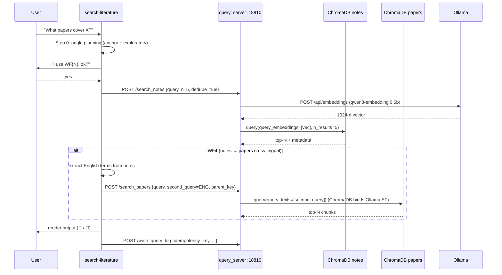

# Project Architecture Blueprint — research-rag

**Generated**: 2026-05-08 (post-commit `58478fd`)
**Scope**: All of `$REPO_ROOT/`. Reflects the actual implementation, not theoretical patterns.
**Audience**: Maintainers, contributors, and reviewers extending or auditing the system.
**Supersedes**: `ARCHITECTURE.md` (narrative) and `COMPONENTS.md` (per-module). Those remain as historical references.

---

## Table of Contents

1. [System Identity](#1-system-identity)
2. [Architectural Overview](#2-architectural-overview)
3. [Architecture Visualization](#3-architecture-visualization)
4. [Layer-by-Layer Reference](#4-layer-by-layer-reference)
5. [Module Dependency Map](#5-module-dependency-map)
6. [Data Architecture](#6-data-architecture)
7. [Cross-Cutting Concerns](#7-cross-cutting-concerns)
8. [Service Communication Patterns](#8-service-communication-patterns)
9. [Python-Specific Patterns](#9-python-specific-patterns)
10. [Implementation Patterns](#10-implementation-patterns)
11. [Testing Architecture](#11-testing-architecture)
12. [Deployment Architecture](#12-deployment-architecture)
13. [Extension and Evolution Patterns](#13-extension-and-evolution-patterns)
14. [Pattern Examples](#14-pattern-examples)
15. [Architectural Decision Records](#15-architectural-decision-records)
16. [Architecture Governance](#16-architecture-governance)
17. [Blueprint for New Development](#17-blueprint-for-new-development)

---

## 1. System Identity

### What it is

A **local-first, Zotero-native, Claude-Code-driven literature RAG system**. Generates structured Chinese-language research notes from PDFs (via a pluggable LLM backend), embeds notes and PDF chunks into a local ChromaDB, and serves ten named retrieval workflows through Claude Code skills.

### Technology stack (auto-detected)

| Concern | Technology | Pinned at |
|---|---|---|
| Language | Python 3.11 | hard requirement |
| Vector DB | ChromaDB | 1.5.5 (Rust backend, no hnswlib) |
| Embeddings | Ollama + `qwen3-embedding:0.6b` (default; swappable to `:4b`/`:8b`/`bge-m3` etc.) | `http://localhost:11434` |
| Web framework | Flask (single-threaded Werkzeug) | `127.0.0.1:18810` |
| PDF I/O | pdfplumber + pypdf | preflight + chunking |
| Source DB | SQLite (Zotero `zotero.sqlite`) | read-only, copied with `shutil.copy2` |
| Note storage | Plain Markdown with YAML frontmatter | filesystem only |
| LLM backends | 5 pluggable: vertex / gemini-api / anthropic / openai / subagent | swap via `--backend` |
| Test framework | pytest 9 | 63 tests, no external SDK required |

### Architectural pattern (auto-detected)

A **hybrid Pipeline + Layered + Plugin** architecture:

- **Layered** at the macro level: Skills → Service → Scanner. Strict downward dependency.
- **Pipeline** within the Scanner: Zotero discovery → preflight → backend dispatch → Stage A (Profiler) → routing → Stage B (Generator) → render → publish → ledger.
- **Plugin** at the LLM-backend boundary: a `ProcessorBackend` ABC with five implementations swappable via env var.

Not microservices (single-host), not Clean Architecture (no domain/use-case rings), not Hexagonal (the ports-and-adapters discipline is selective — applied at the LLM boundary, not everywhere).

---

## 2. Architectural Overview

### Guiding principles (extracted from code, not retrofitted)

1. **Local-first**. The literature corpus is the user's moat. Only the Gemini call leaves the network; ChromaDB and Ollama run on `localhost`.
2. **Notes are source of truth**. There is no master metadata DB. Note frontmatter (`pdf_N_path`, `combined_hash`, `zotero_parent_key`) drives both PDF indexing and dedup recovery. Delete a note ⇒ remove from the index.
3. **Write/read separation**. The Scanner (write path) and Service (read path) are completely decoupled. They communicate only through the filesystem (notes + ledger files). Either can crash without affecting the other.
4. **Idempotency everywhere**. Scanner runs are repeatable; query logs use `idempotency_key`; ChromaDB writes use `upsert` for notes (not `add`); ledger appends are atomic.
5. **Deep modules, small interfaces**. Recent refactors (`_hashing.py`, `zotero_client.py`, `note_render.py`, `dedup_index.py`) hide multi-step implementations behind 1–4 public functions.
6. **KEEP IN SYNC over shared imports**. `scanner/` and `service/` are deployable independently. Where they need identical behavior (hash, parent-key lookup), each has its own copy plus a parity test.

### Boundaries

| Boundary | Where enforced | How |
|---|---|---|
| User vs. system | Skills layer | `search-literature` skill confirmation gate before any retrieval |
| Service vs. Scanner | Filesystem | No imports cross. `service/` reads notes; `scanner/` writes them. |
| Scanner vs. LLM provider | `backends/base.py` ABC | All backends implement `attach_pdfs` + `call_model` |
| Pure logic vs. I/O | Module separation | `_hashing.py` and `note_render.py` are pure; `zotero_client.py` does SQL only |
| Embedding model vs. application | Ollama HTTP boundary | Model can be swapped via `EMBED_MODEL` env var |

### Hybrid pattern adaptations

- **Pipeline-as-orchestrator**: `gemini_analyze_pdf.py:run_multifacet_spec_pipeline` is the canonical pipeline driver. It calls `run_document_profiler` and `run_note_generator` in sequence with model routing in between. Both stages share the same `backend` object.
- **Backend ports & adapters** (selective hexagonal): A 4-method ABC (`attach_pdfs`, `call_model`, `name`, `dispose`) hides whether the call is to Vertex, an OpenAI-compatible server, or a Claude Code sub-agent.
- **Skills-as-orchestrator**: The skills layer doesn't call Python directly. It speaks HTTP to the Service or shells out to the Scanner. Skills are pure Markdown protocols, runnable on any agent runner that respects the SKILL.md format.

---

## 3. Architecture Visualization

### High-level layers

```
┌─ Skills (Markdown, runs in Claude Code) ────────────────────────────┐
│                                                                     │
│  search-literature                                                  │
│   ├── WF1a..WF10 (10 named retrieval workflows)                     │
│   ├── Step 0: angle planning (anchor + exploratory)                 │
│   ├── Step 1: confirmation gate                                     │
│   └── Step 5: structured query log                                  │
│  search-notes / search-papers (leaf API skills)                     │
│  gemini-literature-processor (scanner driver)                       │
│  literature-tagging-pipeline (Kimi tag post-processor)              │
│  rag-engineer / vector-database-engineer / embedding-strategies     │
│                                                                     │
└──────────────────────┬──────────────────────────────────────────────┘
                       │  HTTP localhost:18810
                       ▼
┌─ Service (always-on Flask sidecar + ChromaDB) ──────────────────────┐
│                                                                     │
│  query_server.py :18810                                             │
│   ├── /search_notes   → ChromaDB notes (cosine, whole-doc)          │
│   ├── /search_papers  → ChromaDB papers (L2, 800-char chunks)       │
│   ├── /get_note       → metadata fetch by source/parent_key         │
│   ├── /write_query_log + /append_query_log_action                   │
│   └── /health                                                       │
│                                                                     │
│  build_notes_db.py / build_pdf_db.py / ingest_textbook.py           │
│  (re-run after scanner produces new notes)                          │
│                                                                     │
│  Embeddings: Ollama qwen3-embedding:0.6b @ :11434  (default)        │
└──────────────────────▲──────────────────────────────────────────────┘
                       │  filesystem (notes + ledger)
                       │
┌─ Scanner (one-shot generator) ──────────────────────────────────────┐
│                                                                     │
│  zotero_batch_scanner.py                                            │
│   └── reads zotero.sqlite, dedups, fan-out to subprocesses          │
│       (≤5 sequential, >5 ThreadPoolExecutor(3))                     │
│  gemini_analyze_pdf.py                                              │
│   ├── Stage A: Document Profiler (always flash tier)                │
│   ├── Routing decision (model_routing_policy.json)                  │
│   └── Stage B: Note Generator (flash or pro)                        │
│                                                                     │
│  backends/                                                          │
│   ├── vertex.py        — production: GCS upload + gs:// URI         │
│   ├── gemini_api.py    — direct Gemini API key                      │
│   ├── anthropic_api.py — Claude with base64 PDF + tool-use schema   │
│   ├── openai_api.py    — OpenAI-compatible (text-only PDF)          │
│   └── subagent.py      — manifest-emitter, no API call              │
│                                                                     │
│  Shared modules:                                                    │
│   _hashing.py / zotero_client.py / note_render.py / dedup_index.py  │
│  Maintenance: verify_and_clean.py / backfill_hash.py /              │
│               cleanup_gcs_archive.py / migrate_*.py                 │
└─────────────────────────────────────────────────────────────────────┘
```

### Read path (retrieval)



### Write path (note generation)

```mermaid
sequenceDiagram
    participant Zotero as zotero.sqlite
    participant Batch as zotero_batch_scanner
    participant Dedup as DedupIndex
    participant Analyze as gemini_analyze_pdf
    participant Backend as ProcessorBackend
    participant Vault as $LOCALRAG_NOTES_DIR

    Batch->>Zotero: shutil.copy2 (Zotero must be closed)
    Batch->>Batch: SELECT itemAttachments JOIN items WHERE path LIKE '%.pdf'
    Batch->>Batch: group by parent itemID
    Batch->>Dedup: build(history_path, vault_root)
    Note over Dedup: reads ledger ∪ scans vault for combined_hash + parent_key
    Batch->>Dedup: lookup per group (skip on hit)
    Batch->>Analyze: subprocess per remaining group
    Analyze->>Analyze: combined_hash + run_dir
    Analyze->>Backend: attach_pdfs(prepared_paths, combined_hash)
    Note over Backend: vertex uploads to GCS; gemini-api/anthropic inline; openai pdfplumber-extracts
    Analyze->>Backend: call_model(STAGE_A_PROMPT, schema=document_profile)
    Backend-->>Analyze: document_profile JSON
    Analyze->>Analyze: route flash/pro via model_routing_policy.json
    Analyze->>Backend: call_model(STAGE_B_PROMPT + profile, schema=structured_note)
    Backend-->>Analyze: note_draft (frontmatter + body)
    Analyze->>Analyze: render_multifacet_note (inject Zotero abstract, hashes, paths)
    Analyze->>Vault: write <name>_review_note.md
    Analyze->>Dedup: append(combined_hash) (atomic tmp+os.replace)
    Note over Vault: post-publish hooks (prefill, kimi tag, restart query) optional
```

---

## 4. Layer-by-Layer Reference

### 4.1 Skills layer (`skills/`)

Pure Markdown. Runs inside Claude Code (or any compatible agent runner). No Python execution; the skill speaks HTTP to the Service or shells out to the Scanner.

| Skill | Tier | Role | Talks to |
|---|---|---|---|
| `search-literature/SKILL.md` | Tier-1 orchestrator | 10 workflows (WF1a–WF10), angle planner, confirmation gate, log writer | Service |
| `search-notes/SKILL.md` | Tier-1 leaf | API doc for `/search_notes` | Service |
| `search-papers/SKILL.md` | Tier-1 leaf | API doc for `/search_papers` | Service |
| `gemini-literature-processor/SKILL.md` | Tier-2 driver | scanner invocation modes (full / limited / since-date / single PDF) | Scanner subprocess |
| `literature-tagging-pipeline/SKILL.md` | Tier-2 driver | post-generation Kimi tagging | external Kimi API + vault scripts |
| `infra/{rag-engineer,vector-database-engineer,embedding-strategies}/` | Tier-3 reference | architectural advice, no execution | none |

### 4.2 Service layer (`service/`)

Always-on. Pip dependencies in `requirements-rag.txt`.

| File | Lines | Role |
|---|---|---|
| `query_server.py` | 947 | Flask sidecar exposing 6 endpoints + query log writer |
| `build_notes_db.py` | 182 | Whole-document upsert into ChromaDB `notes` (cosine, manual embed) |
| `build_pdf_db.py` | 315 | Stub-note-driven PDF chunker into ChromaDB `papers` (L2, ChromaDB-bound EF) |
| `ingest_textbook.py` | 171 | Special path for >200-page books (batch=50 to avoid timeouts) |
| `config.py` | 81 | Env-var driven paths, ports, ChromaDB / Ollama URLs |

**Why two builders**: notes are short and queried whole; papers are long and need chunked retrieval with overlap. The collections deliberately use different distance metrics (cosine vs. L2) — see ADR-3.

### 4.3 Scanner layer (`scanner/`)

One-shot. Pip dependencies in `requirements-scanner.txt`. Backend deps optional.

#### Pipeline drivers

| File | Lines | Role |
|---|---|---|
| `zotero_batch_scanner.py` | 624 | Zotero SQLite reader, group dispatcher, retry orchestration |
| `gemini_analyze_pdf.py` | 1688 | Per-group orchestrator: preflight → backend → stages → render → publish |
| `config.py` | (env-config) | Mirrors service/config.py shape |

#### Pluggable backends (`scanner/backends/`)

| File | Lines | Distinguishing trait |
|---|---|---|
| `base.py` | 98 | `ProcessorBackend` ABC (4 methods) |
| `__init__.py` | 196 | `make_backend_from_env(name, **overrides)` factory |
| `vertex.py` | 156 | GCS upload, Vertex SDK, `response_schema` native |
| `gemini_api.py` | 76 | inline `Part.from_bytes`, Google AI Studio key |
| `anthropic_api.py` | 138 | base64 `document` block, schema-as-tool, forced `tool_choice` |
| `openai_api.py` | 250 | pdfplumber extracts text locally, OpenAI tool-calling, fallback to JSON-in-content |
| `subagent.py` | 144 | writes manifest, raises `SubagentManifestPending`, `--resume` finalizes |

#### Shared deep modules

| File | Lines | Public surface | Purpose |
|---|---|---|---|
| `_hashing.py` | 119 | 6 fns | Canonical SHA-256 algorithms (stable + legacy variants), normalization |
| `zotero_client.py` | 159 | 2 fns | Zotero parent-key lookup + abstract fetch (consolidates 3 prior call sites) |
| `note_render.py` | 409 | 4 fns | Pure note rendering: YAML frontmatter, abstract injection, filename resolution, validation |
| `dedup_index.py` | 314 | 1 class, 3 methods | Unified ledger + vault-scan dedup with atomic ledger writes |

#### Maintenance scripts

| File | Lines | Purpose |
|---|---|---|
| `verify_and_clean.py` | 214 | Diff ledger ↔ vault frontmatter; identify ghosts/orphans; `--clean` rewrites |
| `backfill_hash.py` | 179 | Add `combined_hash` to pre-2026-03 notes (no API calls) |
| `cleanup_gcs_archive.py` | 175 | Delete GCS archive blobs older than N days |
| `migrate_combined_hash_to_stable.py` | 369 | One-time migration: legacy → stable hash |
| `force_process.py` | 51 | User-utility: re-process specific paths bypassing the ledger |

---

## 5. Module Dependency Map

### Internal dependency rules (post-DedupIndex)

```
                          ┌─────────────────┐
                          │   config.py     │  (no internal deps)
                          └────────┬────────┘
                                   │
        ┌──────────────────────────┼──────────────────────────┐
        │                          │                          │
        ▼                          ▼                          ▼
  ┌──────────┐            ┌─────────────────┐         ┌───────────────┐
  │_hashing  │◄───────────│  dedup_index    │         │ zotero_client │
  └────┬─────┘            └────────┬────────┘         └───────┬───────┘
       │                           │                          │
       │                           │                          │
       │           ┌───────────────┴──────────┐               │
       │           │                          │               │
       ▼           ▼                          ▼               ▼
  ┌─────────────────────┐               ┌────────────────────────────┐
  │ zotero_batch_       │               │   gemini_analyze_pdf.py    │
  │ scanner.py          │──subprocess──►│   (uses backends/, all    │
  │                     │               │    shared deep modules)    │
  └─────────────────────┘               └─────────────┬──────────────┘
                                                      │
                                                      ▼
                                              ┌──────────────┐
                                              │  backends/   │
                                              │  base + 5    │
                                              │  implementors│
                                              └──────────────┘

  ┌───────────────────────────────────────────────────────────────┐
  │ note_render.py is a pure module: imports only stdlib + pathlib │
  │ (used by gemini_analyze_pdf, no inverse dependency)            │
  └───────────────────────────────────────────────────────────────┘
```

**Layer rule**: nothing in `scanner/` imports from `service/` and vice versa. Cross-deployment guarantee: either layer can be packaged alone.

**Within `scanner/`**: the deep modules (`_hashing`, `dedup_index`, `note_render`, `zotero_client`) are leaf-most — they import only stdlib + thin third-party (yaml). The pipeline drivers import them but not the reverse. No cycles.

**Within `service/`**: `query_server.py` is the largest; it imports `config.py` and stdlib. `build_*.py` are independent siblings.

### External dependency surface

| Dep | Where used | Optional? |
|---|---|---|
| `chromadb==1.5.5` | service only | required for service |
| `flask` | `query_server.py` | required for service |
| `pdfplumber` | `build_pdf_db.py`, `ingest_textbook.py`, `openai_api.py` | required for service + openai backend |
| `pypdf` | `gemini_analyze_pdf.py` (preflight) | required for scanner |
| `pyyaml` | frontmatter parsing across both layers | required |
| `google-genai` | `vertex.py`, `gemini_api.py` | optional (pick one of the 5 backends) |
| `anthropic` | `anthropic_api.py` | optional |
| `openai` | `openai_api.py` | optional |
| `google-cloud-storage` | `vertex.py` (GCS upload) | optional |

Backend SDK imports are **lazy**: each backend file does `import` only when instantiated, so installing only one provider's SDK works.

---

## 6. Data Architecture

### Domain entities

| Entity | Stored as | Identifier |
|---|---|---|
| Paper (PDF group) | List of file paths | `combined_hash` (SHA-256) |
| Note | Markdown file with YAML frontmatter | `<basename>_review_note.md` |
| Vector chunk (paper) | ChromaDB record | `group_{g}_file_{f}_chunk_{k}` |
| Vector chunk (note) | ChromaDB record | `MD5(filename)` (whole-document) |
| Query session | Markdown log | `ql-{YYYYMMDD-HHMMSS}-{SHORT_ID}` |
| Zotero attachment | SQLite row | Zotero attach_key (8-char base62) |

### Persistence layout

| Where | What | Mutability |
|---|---|---|
| `$LOCALRAG_NOTES_DIR/*.md` | Generated notes | Append-only by scanner; user-editable for tags |
| `$LOCALRAG_NOTES_DIR/_query_logs/{YYYY-MM}/*.md` | Per-question logs | Append-only via `/append_query_log_action` |
| `$LOCALRAG_HOME/chroma/` | ChromaDB persistent client | Replaceable (rebuild from notes) |
| `$LOCALRAG_HOME/processed_*.txt` | Service ledgers | Append-only, atomic via `os.replace` |
| `$GEMINI_LITERATURE_SKILL_ROOT/processed_history.txt` | Scanner ledger | Append-only, atomic via DedupIndex |
| `$GEMINI_LITERATURE_SKILL_ROOT/runs/<combined_hash>/` | Per-paper run artifacts | Single-writer per hash |
| GCS `gs://<bucket>/pdf-inputs/<combined_hash>/` | Vertex backend PDF cache | Cleaned by `cleanup_gcs_archive.py` |

### Hash algorithms (canonical reference)

Both algorithms operate on **file bytes** (path-independent):

```python
# stable (canonical, post-2026-03)
def stable_combined_hash(paths):
    file_hashes = sorted(sha256(p.read_bytes()) for p in normalize(paths))
    return sha256(b"".join(h.encode() for h in file_hashes)).hexdigest()

# legacy (path-sorted, pre-2026-03)
def legacy_combined_hash(paths):
    return sha256(b"".join(
        sha256(p.read_bytes()).encode()
        for p in normalize(paths)  # sorted by path, NOT by hash
    )).hexdigest()
```

Difference matters only for multi-PDF groups where path-sort and hash-sort disagree. Both variants are accepted by the dedup index (legacy variant lives in note frontmatter only when it differs from stable).

### Frontmatter contract

15 fixed-order bibliographic fields, then content-addressing block, then PDF paths, then tagging shell. See `note_render.py:_FRONTMATTER_FIELD_ORDER` and the `incremental-note-contract.md` reference. Reordering breaks `service/build_notes_db.py` metadata extraction — coordinate any change.

---

## 7. Cross-Cutting Concerns

### Authentication / Authorization

**Out of scope by design**. Single-user local system. The Service binds to `127.0.0.1` only. The Skills layer relies on the user's existing Claude Code session for authentication. The Scanner authenticates to GCP / Anthropic / OpenAI / etc. via env-configured credentials.

If a future deployment needs multi-user: would require adding a reverse proxy + per-user vault routing. Not in current architecture.

### Error handling and resilience

| Layer | Pattern | Example |
|---|---|---|
| Scanner | `NON_RETRYABLE_ERROR[<code>]` sentinel | `PDFPreflightError` for corrupt/oversize/missing PDFs short-circuits retries |
| Scanner | Exponential backoff | 30s for `429/quota_exceeded`, 10s otherwise; max 3 attempts |
| Service | Lazy collection init with `_ready=False` flags | Endpoints return 503 if Ollama or ChromaDB unavailable |
| Service | Idempotency keys | `/write_query_log` short-circuits on registry hit |
| Backends | `SubagentManifestPending` sentinel | Sub-agent backend exits cleanly mid-pipeline; user finishes via Task tool |
| Dedup ledger | Atomic `os.replace` | `DedupIndex.append` writes tmp, renames; crash mid-write leaves canonical untouched |

No circuit breakers (single-host, no fan-out beyond 3-worker thread pool). No graceful degradation between backends — backend selection is at start-of-batch.

### Logging and monitoring

**Currently `print()`-based** (technical debt — see Tier 3 in `POLISH-EVALUATION.md`). Logs flow to stdout/stderr; subprocess output is captured by the batch scanner with retry-aware parsing of `NON_RETRYABLE_ERROR` markers.

Per-paper artifacts under `runs/<combined_hash>/`:

- `00-pipeline-bootstrap.json` — input snapshot
- `00-model-plan.json` — routing decision (flash vs. pro)
- `01-document-profile.json` — Stage A output
- `02-note-draft.json` — Stage B output
- `04-rendered-note.md` — final assembled note (pre-publish)
- `05-validation-report.json` — frontmatter/body checks

The Vertex backend additionally writes `manifest.json` to GCS for off-host audit.

### Validation

**Three-layer**:

1. **JSON Schema** for backend output (`schemas/document_profile.vertex.schema.json`, `schemas/structured_note.vertex.schema.json`). Each backend translates the schema into its native structured-output mechanism.
2. **Post-render validation** (`note_render.build_multifacet_validation_report`): checks frontmatter presence, body presence, forbidden field absence (`tag_review_status`, `routing_evidence`, etc.). Pure structural validation; no semantic checks.
3. **Vault dedup contract** (`dedup_index.lookup`): every paper attempted is checked against the ledger and live vault before generation; matches short-circuit.

Hand-edited notes are not re-validated post-edit. The contract is: the scanner produces validated output; humans may modify body content but should not change the frontmatter shape.

### Configuration management

Centralized in `scanner/config.py` and `service/config.py`. Both follow the same pattern:

```python
def _env_path(key, default):
    return Path(os.path.expandvars(os.path.expanduser(os.environ.get(key) or default)))
```

Hierarchy: env var → `.env` (loaded externally) → hardcoded default. No secret storage in-repo; `.env.example` documents required keys.

Feature flags: none currently. Backend selection is a config var (`LOCALRAG_PROCESSOR_BACKEND`), not a flag.

---

## 8. Service Communication Patterns

### Inter-process

| Sender | Receiver | Protocol | Format |
|---|---|---|---|
| Skills | `query_server.py` | HTTP POST | JSON |
| `zotero_batch_scanner` | `gemini_analyze_pdf` | subprocess + argv + stderr | argv flags, plain text logs, `NON_RETRYABLE_ERROR[<code>]` markers |
| `gemini_analyze_pdf` | LLM provider | `backend.call_model(...)` | provider-native (Vertex SDK / OpenAI client / etc.) |
| `gemini_analyze_pdf` (subagent backend) | Claude Code Task tool | Filesystem manifests + `--resume` | JSON files at `runs/<hash>/manifest-<stage>.json` |
| `zotero_batch_scanner` | `gemini_analyze_pdf` | `--note-index-file <path>` | JSON serialization of vault index (perf optimization) |

### API surface (`query_server.py`)

| Method | Route | Purpose |
|---|---|---|
| GET | `/health` | Live-check, pings Ollama, returns 200/503 |
| POST | `/search_notes` | Vector search over `notes` collection |
| POST | `/get_note` | Metadata fetch by `source` or `zotero_parent_key` (no embedding) |
| POST | `/search_papers` | Vector search over `papers` collection; supports `second_query` cross-lingual |
| POST | `/write_query_log` | Append-only Markdown log writer with idempotency |
| POST | `/append_query_log_action` | Append `### {timestamp}` block to existing log |

No PUT/DELETE/PATCH. No GraphQL. No streaming. No WebSocket. No SSE. Single-threaded Werkzeug — any upstream stall (Ollama latency) blocks the queue.

### Versioning

Query logs carry `schema_version: 1` in frontmatter. No API versioning on the HTTP surface — the contract is "what the SKILL.md describes is what the server does." Breaking changes are coordinated by editing both the skill and the route in the same commit.

---

## 9. Python-Specific Patterns

### Module organization

- **Top-level scripts** (`scanner/zotero_batch_scanner.py`, `service/query_server.py`) have `def main()` + `if __name__ == "__main__"`.
- **Deep modules** (`_hashing.py`, `note_render.py`) define `__all__` and a small `def` set; no module-level state.
- **Class-based** only when state needs encapsulation: `DedupIndex`, `ProcessorBackend` subclasses.
- **No package** for `service/` or `scanner/`; flat directories. `tests/conftest.py` injects `scanner/` onto `sys.path`. This is intentional: each layer is a deployable unit, not an installable package.

### Async / concurrency

- Scanner uses `concurrent.futures.ThreadPoolExecutor(3)` for batch >5 (subprocess-bound work, GIL irrelevant).
- Service is single-threaded by Werkzeug default (acceptable: single-user local).
- No `asyncio` anywhere. The codebase predates the FastAPI era and has no compelling reason to migrate.

### Dependency management

- Two requirements files: `requirements-rag.txt` (service), `requirements-scanner.txt` (scanner). Backends are organized as commented opt-in blocks.
- `setup.sh` / `setup.ps1` create **two separate venvs** (`service/.venv` and `scanner/.venv`). This isolates ChromaDB's pinned binary deps from the scanner's optional SDK soup.

### Type hints

- `from __future__ import annotations` in newer modules (`_hashing.py`, `dedup_index.py`, `note_render.py`).
- Type hints used for documentation, not enforcement (no mypy yet — Tier 3).
- Older modules (`gemini_analyze_pdf.py`, `query_server.py`) are mostly untyped.

---

## 10. Implementation Patterns

### Interface design (deep-module discipline)

Recent refactors all follow the same shape: small public `__all__`, large private helpers.

```python
# scanner/note_render.py
__all__ = [
    "build_multifacet_frontmatter",
    "resolve_multifacet_generated_name",
    "render_multifacet_note",
    "build_multifacet_validation_report",
]
# 4 public functions, ~10 private helpers
```

```python
# scanner/dedup_index.py
__all__ = ["DedupIndex"]
# 1 class, 3 methods (build, lookup, append) + 1 convenience (covers)
```

### Service implementation

**Lifecycle**: lazy at startup. Each ChromaDB collection has a `_ready` flag; failure to load sets it False, the corresponding endpoints return 503. `LOCALRAG_SKIP_CHROMA_INIT=1` bypasses entirely (test mode).

**Composition**: no DI container. Endpoints reach into module-level globals (`notes_col`, `papers_col`). Acceptable because the server is single-user and the globals are init-once.

**Operation template**:
```python
@app.route("/search_notes", methods=["POST"])
def search_notes():
    if not notes_ready: return "...", 503
    body = request.get_json()
    query = body["query"]
    n = body.get("n", 5)
    embedding = get_embedding(query)
    raw = notes_col.query(query_embeddings=[embedding], n_results=n, where=...)
    return jsonify(format_search_results(raw))
```

### Repository pattern (informal)

- `zotero_client.py` is the de-facto repository for Zotero SQLite reads. Two methods, both side-effect-free SELECT.
- No write-side repository — frontmatter parsing is inline in `dedup_index.py:_read_note_frontmatter` and `service/build_notes_db.py`. Acceptable at this scale; would warrant extraction if a third caller appears.

### Domain model

- **Paper / PDF group**: implicit, modeled as `list[Path]` + `combined_hash`. No class.
- **Note draft**: a dict `{"frontmatter": {...}, "body_markdown": "..."}`. Schema-validated, not class-validated. Trade-off: easy to construct in tests, hard to make invalid states unrepresentable.
- **Backend output**: raw dict from JSON parsing. `_validate_against_schema` recursively checks shape.

This is "primitive obsession" by some standards, but the volumes are tiny (one paper at a time) and the upstream JSON Schema validation provides shape guarantees.

---

## 11. Testing Architecture

### Test layout (`tests/`, 63 tests across 8 files)

| File | Tests | Covers |
|---|---|---|
| `test_hashing.py` | 7 | Stable + legacy hash, normalization, variant matching |
| `test_hash_parity.py` | 4 | Service↔scanner hash parity (KEEP IN SYNC enforcer) |
| `test_zotero_client.py` | 6 | `get_parent_key` strategies, `get_zotero_abstract_note` |
| `test_zotero_client_parity.py` | 4 | Service↔scanner parent-key parity |
| `test_note_render.py` | 24 | YAML quoting, field ordering, abstract injection, filename resolution, validation, legacy_hash conditional |
| `test_dedup_index.py` | 13 | Vault recovery (3 paths), ledger fallback, atomic append, end-to-end F1 scenario |
| `test_subagent_backend.py` | 4 | Manifest emission, resume flow |
| `test_backend_factory.py` | 4 | `make_backend` selection by name |

**No external SDK required** for any test. Every backend other than subagent has its SDK calls mocked. ChromaDB tests use the in-memory fallback (LOCALRAG_SKIP_CHROMA_INIT mode).

### Boundaries

- **Unit tests** dominate: pure functions in `_hashing.py`, `note_render.py`, `dedup_index.py` are tested with synthetic inputs.
- **Parity tests** are a unique pattern here: `test_hash_parity.py` and `test_zotero_client_parity.py` AST-extract the scanner-side and service-side implementations, exec them in isolated namespaces, and assert byte-for-byte output equality. Drift triggers a CI failure rather than a silent runtime divergence.
- **No integration tests** that exercise the full Zotero → Vault flow (would require a real Zotero install, GCS bucket, and Gemini quota). Intentional — the parity tests + per-layer unit tests cover the moving parts.

### Mocking and fixtures

- `tmp_path` fixture is the workhorse for filesystem tests.
- Fixtures synthesize Zotero SQLite databases inline (see `test_zotero_client.py:fixture_db`) — no fixture files committed.
- `monkeypatch` is used to inject failures (`os.replace` simulator in `test_dedup_index.py`).

---

## 12. Deployment Architecture

### Topology

Single host. Three runtime processes:

| Process | Lifecycle | Manager |
|---|---|---|
| Ollama | Long-lived | `ollama serve` (system service or one-off) |
| `query_server.py` | Long-lived | Manual `python query_server.py` (or process manager of choice) |
| Scanner subprocesses | One-shot | Spawned by `zotero_batch_scanner.py`, joined or pool-managed |

No supervisor (e.g. systemd, supervisord) is required or supplied. Adding one is trivial; not in scope for the current shape.

### Environment configuration

`.env.example` documents every var. Required differs by backend:

| Backend | Required env |
|---|---|
| vertex | `GOOGLE_APPLICATION_CREDENTIALS`, `GOOGLE_CLOUD_PROJECT`, `GEMINI_VERTEX_GCS_BUCKET` |
| gemini-api | `GEMINI_API_KEY` |
| anthropic | `ANTHROPIC_API_KEY` |
| openai | `OPENAI_API_KEY` (+ `OPENAI_BASE_URL` for compatible providers) |
| subagent | none (uses Claude Code's session) |

Universal: `LOCALRAG_NOTES_DIR`, `ZOTERO_DATA_DIR`, `LOCALRAG_HOME`.

### Containerization

Not provided. Docker compose for `Ollama + ChromaDB + query_server` is in the Tier-3 backlog (`POLISH-EVALUATION.md`). The reasons it's not done:

1. ChromaDB 1.5.5 with the Rust backend is sensitive to the host arch (no hnswlib fallback). A user-supplied venv is more portable than a container with the wrong CPU arch.
2. The vault directory is huge (often >10 GB) and bind-mounting it in Docker on Windows/macOS has FS performance penalties.
3. Single-user, single-host design — orchestration overhead exceeds the win.

### Cross-platform

- Windows: PowerShell `setup.ps1`, paths handled via `pathlib.Path` everywhere except a few legacy `os.path.join` calls.
- Unix: bash `setup.sh`, identical structure.
- macOS: untested but should follow Unix path. No code path explicitly Linux-specific.

---

## 13. Extension and Evolution Patterns

### Where to add new features

| Adding... | Where it goes | What you touch |
|---|---|---|
| A new LLM provider | New file under `scanner/backends/` | Implement `ProcessorBackend` ABC; register name in `__init__.py:make_backend` |
| A new note template | `scanner/template_rules/<id>.txt` + frontmatter enum | Add to `note_template` allowed values; ship a Stage B prompt fragment |
| A new retrieval workflow | `skills/search-literature/SKILL.md` | Add WF{N} entry; add angle-mapping line to "WF and angle pairing" section |
| A new query log field | `service/query_server.py` write side + read side | Bump `schema_version`; update SKILL log-payload spec |
| A new frontmatter field | `scanner/note_render.py:_FRONTMATTER_FIELD_ORDER` | Coordinate with `service/build_notes_db.py` metadata extraction |
| A new dedup variant (3rd hash variant) | `scanner/_hashing.py:combined_hash_variants` | Update `accepted_hashes`; add to frontmatter when variant differs |
| A new maintenance script | `scanner/<verb>_<noun>.py` | Use `from config import VAULT_ROOT, PROCESSED_HISTORY_PATH`; reuse `_hashing` and `dedup_index` |

### Modification safety rules

- **Frontmatter field reorder**: always update `_FRONTMATTER_FIELD_ORDER` and `service/build_notes_db.py` together. Test: `test_yaml_field_ordering_stable`.
- **Hash algorithm change**: never silently. Add a new variant in `_hashing.py`, add it to `accepted_hashes`, write a migration script (template: `migrate_combined_hash_to_stable.py`), and emit it in note frontmatter so future ledger rebuilds recognize it.
- **Service↔scanner duplicated function change**: parity test will catch drift. Update both copies; run `pytest tests/test_*_parity.py`.
- **Skill renumbering**: workflows are a stable contract from the user's mental model. Renumbering (WF1a → WF11) breaks query log search. Don't do it.

### Integration patterns

For a new external system (e.g. add Mendeley alongside Zotero):

1. Write a `mendeley_client.py` in `scanner/` mirroring `zotero_client.py`'s shape.
2. Add a `--source mendeley` flag in `zotero_batch_scanner.py` (rename to `batch_scanner.py` or `library_scanner.py`).
3. Don't merge the two clients into one polymorphic interface unless a third source appears. Two-of-a-kind is not a pattern; three-of-a-kind is.

---

## 14. Pattern Examples

### Layer separation: pure rendering vs. I/O fetcher

Note rendering used to fetch the Zotero abstract inline. The refactor split that out:

```python
# scanner/note_render.py — pure
def render_multifacet_note(note_draft, pdf_paths, combined_hash, ...,
                           zotero_abstract: str = ""):
    """Caller fetches abstract upstream; this function does no I/O."""
    ...

# scanner/gemini_analyze_pdf.py — shim that does the I/O
def render_multifacet_note(note_draft, pdf_paths, combined_hash, ...):
    """Backwards-compatible shim; fetches from Zotero, then delegates."""
    abstract = get_zotero_abstract_note(zotero_parent_key, ...) or ""
    return _render_multifacet_note(..., zotero_abstract=abstract)
```

Pattern name: **functional core, imperative shell**. Tests for the rendering can be a single dict; no SQLite fixture needed.

### Plugin discovery: backend factory

```python
# scanner/backends/__init__.py
BACKEND_NAMES = ("vertex", "gemini-api", "anthropic", "openai", "subagent")

def make_backend(name, **overrides):
    if name == "vertex":
        from .vertex import VertexBackend
        return VertexBackend(**overrides)
    elif name == "gemini-api":
        from .gemini_api import GeminiAPIBackend
        return GeminiAPIBackend(**overrides)
    # ... etc
    raise ValueError(f"Unknown backend: {name}")
```

Lazy imports = optional SDK dependencies. Pattern works because backends were always going to be 4–6 in count, not unbounded; entry-points / setuptools registration would be over-engineering.

### Drift enforcement: parity test

```python
# tests/test_hash_parity.py
def _load_service_combined_hash():
    """AST-extract get_combined_hash from service/build_pdf_db.py and exec
    it in an isolated namespace to avoid triggering module side-effects."""
    src = (REPO / "service" / "build_pdf_db.py").read_text()
    tree = ast.parse(src)
    fn_src = next(ast.get_source_segment(src, n) for n in tree.body
                  if isinstance(n, ast.FunctionDef) and n.name == "get_combined_hash")
    namespace = {"hashlib": hashlib, "os": os}
    exec(fn_src, namespace)
    return namespace["get_combined_hash"]

def test_stable_hash_matches_service_implementation(tmp_path):
    pdf = tmp_path / "x.pdf"
    pdf.write_bytes(b"hello")
    assert stable_combined_hash([pdf]) == _load_service_combined_hash()([pdf])
```

This is the structural backbone of the KEEP IN SYNC convention.

### Atomic ledger append

```python
# scanner/dedup_index.py
def append(self, combined_hash):
    if combined_hash in self._ledger_hashes:
        return
    existing = path.read_text() if path.exists() else ""
    if existing and not existing.endswith("\n"):
        existing += "\n"
    new_content = existing + combined_hash + "\n"
    fd, tmp = tempfile.mkstemp(prefix=path.name + ".", suffix=".tmp", dir=path.parent)
    with os.fdopen(fd, "w", encoding="utf-8") as fh:
        fh.write(new_content)
    os.replace(tmp, str(path))
    self._ledger_hashes.add(combined_hash)
```

Read-rewrite-replace beats append-only here: 75 KB ledger, full rewrite is cheap, atomicity is free.

---

## 15. Architectural Decision Records

### ADR-1: Layered macro / pluggable LLM backend (rather than microservices or pure hexagonal)

**Context**: The system spans note generation (one-shot, expensive) and retrieval (always-on, cheap). Original implementation tightly coupled scanner code to Vertex AI.

**Decision**: Three-layer macro structure with a single port (the LLM backend).

**Alternatives considered**:
- Microservices — rejected: single user, no shared state to coordinate, would add ops cost without benefit.
- Pure hexagonal — rejected: would require ports for Zotero, ChromaDB, and Ollama too. Each abstraction adds maintenance; only the LLM boundary needs swapping.
- Monolith — rejected: scanner can't be invoked by service (different deps), and bundling them defeats the per-venv isolation that ChromaDB pinning requires.

**Consequences**: Clean independence of scanner and service. Backend addition costs are bounded. No abstraction tax on Zotero or Ollama (single-implementation by design).

### ADR-2: Notes as source of truth (no master metadata DB)

**Context**: Could use SQLite/Postgres as a paper-metadata catalog. Was rejected during initial design.

**Decision**: Note frontmatter is canonical. PDF indexing reads `pdf_N_path` from notes; dedup recovery reads `combined_hash` from notes; tagging state is on disk; everything is plain Markdown.

**Alternatives**: SQLite catalog — would require migration scripts on every schema change, would diverge from notes silently, and can't be `cat`-ed.

**Consequences**: Filesystem ops are the source of "transactions". `processed_history.txt` is a cache, not an authority — `DedupIndex` rebuilds from vault if missing. Pro: dead simple, portable, text-editor-debuggable. Con: large vaults are slow to scan (mitigated: 700 notes < 1s).

### ADR-3: Cosine for notes, L2 for paper chunks

**Context**: Two ChromaDB collections, two distance metrics. Looks like a bug.

**Decision**: Notes use `cosine` (set explicitly); papers use ChromaDB's default `l2` (not overridden when the collection was created).

**Why retained**: Notes are normalized-length whole documents; cosine is conventional and matches embedding model recommendation. Papers are 800-char chunks with strong magnitude signals (longer chunks have higher norm); L2 has worked well empirically.

**Consequences**: Score scales differ between endpoints (`/search_notes` returns `1 - cosine_distance`, `/search_papers` returns raw L2). Skills layer presents both as opaque "relevance" scores.

**Future**: If we ever rebuild papers, switching to cosine and re-evaluating quality is on the menu. Not a current priority.

### ADR-4: Duplicated `combined_hash` in `scanner/_hashing.py` and `service/build_pdf_db.py`

**Context**: Tempting to share via a `common/` package.

**Decision**: Duplicate. Each layer carries its own copy. A `KEEP IN SYNC` comment + parity test enforce equality.

**Why**: `scanner/` and `service/` are deployable independently (different venvs, different requirements). A `common/` package would force a third installable package or a `pip install -e ../common` development setup that's hostile to the "clone and run" promise.

**Consequences**: 30 lines duplicated. Drift detected at PR time by parity tests. Net win on simplicity and deploy independence.

### ADR-5: DedupIndex as a deep module rather than four surgical patches

**Context**: User reported history-file fragility (F1–F4: solo-mode auto-heal missing, hardcoded paths, legacy hash unrecoverable, non-atomic append).

**Decision**: Create `scanner/dedup_index.py` (one class, ~60 lines of public surface) instead of patching three call sites independently.

**Alternatives**:
- Four surgical patches (Option A from `architecture-discussion-2026-05-08`) — rejected: same bug would re-appear if a fourth caller emerged.
- SQLite migration (Option C) — rejected: the only feature delta would be richer metadata storage; not justified by current queries.

**Consequences**: Three call sites collapse to one. Atomic write becomes a property of the module, not each caller. Test coverage moves from spread-across-files to one focused file (`test_dedup_index.py`). Cost: one more module in `scanner/`.

### ADR-6: Pure modules (`note_render`, `_hashing`) over service classes

**Context**: Initial scaffolding considered `NoteRenderer` and `Hasher` classes.

**Decision**: Module-level functions with no shared state. `__all__` declares the public surface; private helpers are underscore-prefixed.

**Why**: These modules have zero need for state. A class would invite "init with config, then call methods" patterns that complicate testing without payoff. `from note_render import render_multifacet_note` is the most readable form.

**Consequences**: No DI, no `instance.method(x)` ceremony. Fits Python idioms. Easy to unit-test (no fixtures).

---

## 16. Architecture Governance

### Consistency mechanisms

1. **Parity tests** for service↔scanner duplicated functions.
2. **Frontmatter validation** in `note_render.build_multifacet_validation_report`.
3. **Schema validation** for backend output via JSON Schema.
4. **Idempotency-key registry** for query logs (deduplication on retry).
5. **Atomic ledger writes** prevent partial-state corruption.

### Drift between docs and code

Historically a problem (the `INVESTIGATION-INDEX.md` table called out 4 drift cases). Current mitigations:
- Audit reports archived under `docs/audits/` after each major batch.
- This blueprint replaces the older fragmented narrative.
- `STATUS.md` tracks "what changed" with commit references.

### What is NOT enforced

- **Style/lint**: no ruff, no black, no mypy in CI yet (Tier 3).
- **Pre-commit hooks**: none yet.
- **Type checking**: gradual; only newer files have `from __future__ import annotations`.
- **Test coverage**: no minimum threshold, no badge.

These are deliberate gaps for this stage of the project, not oversights.

### Review process

- Architectural changes that touch a deep module: open an audit under `docs/audits/<date>-<topic>-review.md` (template: existing audits in that directory).
- Backend additions: must extend `BACKEND_NAMES` and pass `test_backend_factory.py`.
- New tests live alongside the module they cover; conftest pattern is `tests/conftest.py:sys.path.insert`.

---

## 17. Blueprint for New Development

### Workflow for a new feature

1. **Identify the layer** the feature lives in (Skills / Service / Scanner).
2. **Scope the contract change**:
   - New endpoint? Update `query_server.py` + corresponding `search-*` SKILL.md in the same commit.
   - New scanner output field? Update `note_render._FRONTMATTER_FIELD_ORDER` + `service/build_notes_db.py` metadata extraction.
   - New backend? Implement ABC, register in factory, add a SDK-mocked smoke test.
3. **Write the test first** when the change is in a deep module. Pure modules earn fast TDD.
4. **Run `pytest tests/`** — must remain green.
5. **Commit per logical unit**, not per file. Reference the relevant ADR if you're touching one of the documented decisions.

### File-creation templates

**New scanner module** (e.g. a third-party integration):

```python
"""<one-paragraph purpose>.

KEEP IN SYNC with <sibling>, if applicable. Drift caught by tests/<parity_test>.py.
"""

from __future__ import annotations

# stdlib
# third-party (lazy if it's a SDK)
# local: prefer `from config import ...` over hardcoded paths

def public_entry_point(...):
    """One short docstring; the WHY belongs in module-level docstring."""
    ...

__all__ = ["public_entry_point"]
```

**New service endpoint**:

```python
@app.route("/<verb>", methods=["POST"])
def <verb>():
    if not <collection>_ready: return jsonify({"error": "not ready"}), 503
    body = request.get_json() or {}
    # validate required keys
    # do the work
    # return a JSON envelope: {"results": [...], "metadata": {...}}
```

**New backend**:

```python
# scanner/backends/<name>.py
from .base import ProcessorBackend

class <Name>Backend(ProcessorBackend):
    name = "<name>"

    def attach_pdfs(self, prepared_paths, *, combined_hash):
        ...

    def call_model(self, prompt, *, system_prompt, schema, temperature, max_tokens):
        ...

    def dispose(self):
        ...
```

Then in `backends/__init__.py`:

```python
elif name == "<name>":
    from .<name> import <Name>Backend
    return <Name>Backend(**overrides)
```

And add to `BACKEND_NAMES`.

### Common pitfalls

- **Hardcoded paths** in maintenance scripts. Always import from `config.py`. F2 was exactly this bug.
- **Mid-file imports** for "lazy loading reasons". Move to top of file unless there's a circular-import reason. Linting CI will eventually flag these.
- **Frontmatter field changes without coordinating with `service/build_notes_db.py`**. Fields you add silently won't appear in ChromaDB metadata.
- **Skipping the parity test** when adding a service-side helper that mirrors a scanner-side one. Drift is the slowest, most expensive bug class in this codebase.
- **`dedup_index.append(combined_hash)` after a failed pipeline run**. Only append on success. Failure to append + vault note absent = correct re-process on next run; spurious append + no note = silent skip forever.

### Performance considerations

- **Vault scan** is O(N) per `DedupIndex.build`. For >2000 notes, consider passing `cached_note_index` from a cron-built JSON.
- **Ollama embedding** is the slowest synchronous hop in retrieval. Default `qwen3-embedding:0.6b` ~20–40 ms per query (`:4b` ~50–100 ms when upgraded). Don't pre-embed query text; let it ride.
- **Scanner** scales with PDF count × backend latency. Vertex AI is fastest (paid, GCS-cached); subagent is slowest (manual sub-agent dispatch). For a 100-paper batch, expect minutes, not seconds.

### Testing blind spots

- **Real ChromaDB integration**: not tested in CI. Manual smoke runs cover this.
- **Real Ollama integration**: not tested.
- **Real LLM backend output quality**: cannot be unit-tested. Periodic eyeball review of new note frontmatter is the human-in-the-loop check.
- **Vault scan performance** on huge corpora: not benchmarked. Add timing if it ever matters.

---

## Appendix A: Quick reference

### File-counts snapshot (post-`58478fd`)

```
scanner/         ~3700 lines (10 .py files + 7 backends/)
service/         ~1700 lines (5 .py files)
tests/           ~1200 lines (8 test files, 63 tests)
skills/          ~6 SKILL.md + supporting prompts/schemas/templates
docs/            ~10 markdown reference docs
```

### Where to read more

- `docs/PACKAGING-PLAN.md` — release-readiness checklist (P0/P1/P2 prioritization)
- `docs/POLISH-EVALUATION.md` — Tier 1/2/3 polish roadmap
- `docs/audits/` — historical sub-agent code reviews
- `docs/investigation/` — original reverse-engineering reports (frozen 2026-05-08)
- `docs/plans/` — design RFCs that landed in code

### Keeping this blueprint current

Update on:
- Any new layer or major module added
- Any ADR-impacting decision (new backend, new dedup variant, etc.)
- Any drift fix between docs and code

Do not update for:
- Single-file refactors that don't change interfaces
- Test additions
- Bug fixes within existing patterns

When in doubt: if a future contributor would mistake old-blueprint for current-state, update.
